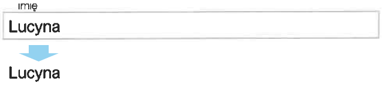

# OCR forms

This repository contains some interesting solutions used for document processing before the OCR process.

The solutions are written in [Python](https://www.python.org/).

## 1. How to remove frames from fields on a form

https://nbviewer.jupyter.org/github/klosow/ocr-forms/blob/master/frames-removal.ipynb

